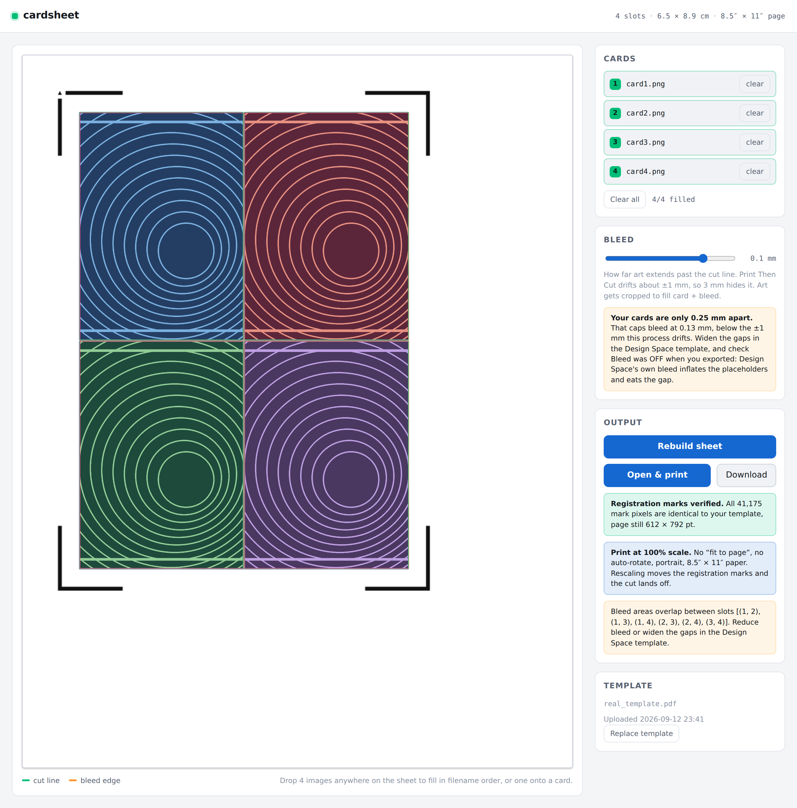

# cardsheet

A small self-hosted app for the Cricut Print-Then-Cut card workflow. Drop four
card images on a sheet, hit print, print as many copies as you want on your own
printer. Cricut only ever does the cutting.



## What it actually does

Design Space owns the registration marks. This app does not try to recreate
them, it **reuses them**. You give it one Design Space print-to-PDF export, and
every sheet it builds *is* that PDF page with your art stamped on top as an
overlay.

The original page objects are never re-encoded. Whatever Design Space drew,
corner marks, an orientation arrow, anything at all, survives exactly as it was
written. The app has no idea what shape the marks are and does not need to.

After each build it proves this: it renders your template and the output,
isolates every pixel of ink outside the card areas, and compares them. The UI
shows a green badge with the count. A single changed mark pixel, or any change
within 20px of one, fails the check.

```
your Design Space template PDF  ──►  stored once in the volume
                                        │
  drop 4 images in the browser  ──►  composited onto that exact page
                                        │
                                     sheet PDF  ──►  your printer, N copies
                                        │
                        pre-printed cardstock  ──►  Cricut cuts
```

## Run it

```bash
docker compose up -d --build
# http://localhost:8080
```

The template and generated sheets live in `./data`, so they survive restarts
and rebuilds. Change the host port in `docker-compose.yml` if 8080 is taken.

## First run, once

The app walks you through this on the setup screen:

1. Upload `template_2x2_63x88mm_letter.svg` to Design Space.
2. Set units to cm, confirm each card reads **6.3 × 8.8**.
3. Set all four rectangles to **Print Then Cut**.
4. Select all four and **Attach**, so Design Space cannot rearrange them.
5. **Save the project.** This is what you reopen for every cut.
6. Make It → Print Setup → **Bleed OFF** → Send to Printer → **Save as PDF**.
   Cancel out of the cut step.
7. Drop that PDF into the app.

**Bleed must be off**, and leave real gaps between the cards.

Design Space's bleed inflates each placeholder by about 0.76 mm per side
(0.03 in). The app then detects the inflated edge instead of the true cut line,
and that growth eats into the gaps between cards. Exporting a 63 x 88 mm card
with bleed on measures 64.5 x 89.5 mm, and a 1.77 mm gap collapses to 0.25 mm.

Gaps matter because bleed can only use half the gap per side before
neighbouring cards paint over each other. An 8 mm gap gives you 4 mm of bleed
headroom, comfortably over the +/-1 mm this process drifts. The app reads the
gaps out of your template, caps the bleed slider accordingly, and warns you on
the spot if there is not enough room.

## Every sheet after that

Drop four images anywhere on the sheet and they fill in filename order, or drop
one onto a specific card. Click a card to browse. Build sheet, then Open &
print.

The preview shows the real page with its registration marks, a green cut line,
and an orange bleed edge, so you can see exactly what survives the cut before
you commit paper.

**Print at 100% scale.** No "fit to page", no auto-rotate, portrait, Letter.
Rescaling moves the registration marks and the cut lands off. This is the only
way the workflow fails.

## Cutting

Reopen the saved Design Space project and Make It. At the print step there is a
link that says **"I've already printed this"**. Click it, load your pre-printed
sheet on the mat, and cut. Design Space never touches your printer.

If Design Space thinks it has not printed yet, the link is on the right-hand
side of the print prompt.

## Art sizing

Cover-fit: scaled to fill card plus bleed, centre-cropped. Supply art near the
card aspect ratio so you do not lose edges.

At 300 DPI with 3.2 mm bleed, a 6.3 × 8.8 cm card wants about **819 × 1102 px**.
Keep anything important 3 mm inside the cut line, since Print Then Cut drifts
about ±1 mm.

## API

The UI is a thin client over these, if you want to script it.

| Method | Path | Notes |
|---|---|---|
| `GET` | `/api/template` | current template + slot geometry in px/in/cm/mm |
| `POST` | `/api/template` | multipart `file`, the Design Space PDF |
| `DELETE` | `/api/template` | forget it |
| `GET` | `/api/template/preview.png` | `?guides=0` for the bare page |
| `POST` | `/api/compose` | `files[]`, `slots` (JSON index array), `bleed_mm` |
| `GET` | `/api/sheet/{id}.pdf` | `?download=1` to force attachment |
| `GET` | `/api/sheet/{id}/verify` | mark-integrity report for that sheet |
| `GET` | `/api/health` | |

```bash
curl -F "file=@ds_template.pdf" localhost:8080/api/template

curl -X POST localhost:8080/api/compose \
  -F "files=@a.png" -F "files=@b.png" -F "files=@c.png" -F "files=@d.png" \
  -F "slots=[0,1,2,3]" -F "bleed_mm=3.2"
```

Slot detection is geometry-driven, not hardcoded. Any grid of magenta
rectangles works, so a 2×3 legal template or a 4×4 tabloid one needs no code
change. Slots come back in reading order.

## Stack

Svelte 5 + Vite 6 built to static, served by FastAPI. One image, one port, one
volume. No database.

## Verification status

Run and verified in a live browser: template upload, slot detection at
6.3 × 8.8 cm, all four drop targets, build, and the mark check. On the test
template all 21,508 registration-mark pixels came through byte-identical, with
zero change inside a 20px halo around them, and the page measured exactly
612 × 792 pt in and out.

`GET /api/sheet/{id}/verify` returns that report as JSON if you want to assert
on it from a script.

The Dockerfile itself was not built, because the sandbox this was written in has
no Docker daemon. Both of its stages were run natively against the pinned
versions (`npm ci` tree, `pip` resolution on Python 3.11), so it should build
clean, but the first `docker compose up --build` is the real test.
